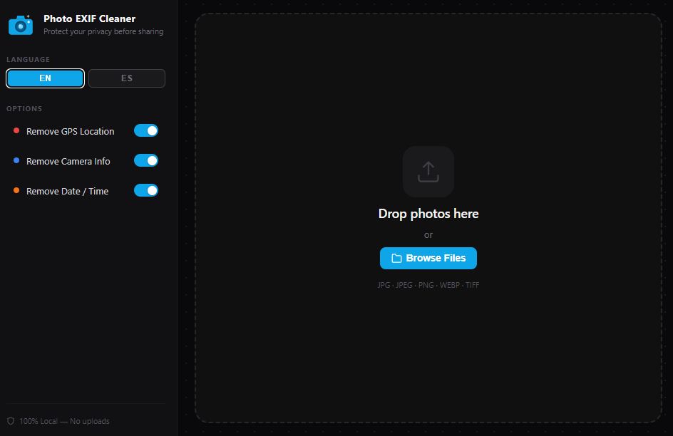

<div align="center">
  

  <h1>Photo EXIF Cleaner</h1>
  <p><strong>A lightning-fast, privacy-first local desktop app to strip metadata from your photos.</strong></p>

  <p>
    
    
    
    
  </p>
</div>

---

## 📸 Screenshot



## ✨ Features

- **100% Local Processing:** Your photos never leave your machine. No cloud uploads, no privacy risks.
- **Multi-Format Support:** Reads and cleans `.jpg`, `.jpeg`, `.png`, `.webp`, `.tif`, and `.tiff` files.
- **Real-Time EXIF Reader:** Powered by Rust's `kamadak-exif` to accurately parse up to 17 different metadata fields including GPS, Camera Make/Model, Exposure, ISO, and more.
- **Batch Processing:** Drag and drop an entire folder of photos to clean them all at once.
- **Safe Output:** Automatically creates a `Cleaned` subfolder next to your originals. Your original photos are never overwritten.
- **Bilingual Interface:** Fully translated into English and Spanish (i18n).
- **Beautiful UI:** A sleek, modern dark mode with color-coded metadata tags so you know exactly what sensitive data is hidden in your photos.

## 🚀 How it Works

1. **Frontend (SvelteKit):** Provides a fluid, reactive UI. When you select files, it passes the file paths to the backend.
2. **Backend (Rust):** Reads the raw bytes of the image, generates a fast Base64 preview for the UI, and parses the EXIF data.
3. **Cleaning (img-parts):** Strips the EXIF headers at the byte level without re-encoding the image, meaning **zero quality loss**.

## 🛠️ Development

### Prerequisites

- [Node.js](https://nodejs.org/) (v18+)
- [Rust](https://www.rust-lang.org/tools/install) (latest stable)
- Tauri dependencies for your OS (Windows Build Tools, etc.)

### Running the App

```bash
# Install Node dependencies
npm install

# Start the development server and the Tauri window
npm run tauri dev
```

### Building for Production

```bash
# This will generate an installer (.exe, .msi, .dmg, or .AppImage depending on your OS)
npm run tauri build
```

## 🛡️ Privacy First

This tool was built because taking a photo on a modern smartphone saves exact GPS coordinates, timestamps, and device serial numbers into the image file. Sharing these photos online can inadvertently expose your home address or daily routines. **Photo EXIF Cleaner ensures your shared photos contain only the pixels, nothing else.**

---
*Built with ❤️ using Tauri & SvelteKit.*

